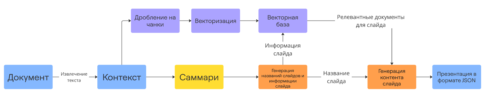

# ML

## Описание решения

Для генерации презентации по запросу пользователя используется LLM, которая генерирует структуру презентации и её содержание. Реализованы 3 функции, которые производят следующий функционал:

1. Генерация заголовков слайдов презентации
2. Генерация содержимого презентации
3. Изменение содержимого слайда по запросу пользователя

Также решение предусматривает генерацию презентации по загруженному файлу с текстовым описанием (rag_pipeline.ipynb). Внутри реализовано параллельное суммаризирование описания, векторизация текста и генерация содержимого слайда на основе релевантных документов. Весь пайлпайн обёрнут в Docker сервис.

## Структура
- **rag_pipeline.ipynb**: Пайплайн генерации презентации на основе файла с использование RAG.
- **one_prompt_generation**: JavaScript код для генерации презентации напрямую через модель.
- **service**: Сервис, который генерирует презентации по запросу пользователя и текстовому файлу.
- **test_data**: Тестовые текстовые документы, содержащие описание проекта Атом.Око.